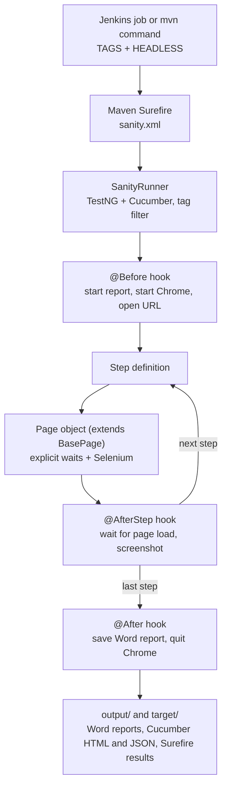

# Banking Automation - Hybrid Test Automation Framework


An end-to-end UI test automation framework for the [ParaBank](https://parabank.parasoft.com/parabank/index.htm) demo banking application. Tests are written as readable Gherkin scenarios, executed through TestNG, structured with the Page Object Model, and can be run from the command line or from a Jenkins pipeline by choosing Cucumber tags.

Every scenario also produces its own **Word evidence report with a screenshot per step**, plus a run summary.

---

## Highlights

- **BDD with Cucumber:** business-readable feature files, reusable step definitions, Scenario Outlines for data-driven negative testing.
- **Page Object Model:** one class per screen on top of a `BasePage` that wraps Selenium with explicit waits. There are no `Thread.sleep` calls anywhere.
- **Tag-based execution:** run the sanity set, only negative tests, or one module, without changing code.
- **CI-ready:** a declarative `Jenkinsfile` with `TAGS` and `HEADLESS` parameters, JUnit result publishing and report archiving.
- **Automatic evidence:** screenshots are captured in an `@AfterStep` hook and written to a Word document per scenario (Apache POI).
- **Data kept out of code:** test data in XML files, environment settings in `config.properties`.
- **Parallel-ready design:** the WebDriver and report state are held in `ThreadLocal`.
- **Safe XML reading:** the parser blocks external entities, and a missing file or tag fails with a clear message instead of an empty value.

---

## Tech stack

| Area | Tool | Version |
| --- | --- | --- |
| Language | Java | 17 |
| Browser automation | Selenium WebDriver | 4.15.0 |
| BDD | Cucumber (cucumber-java, cucumber-testng) | 7.15.0 |
| Test runner | TestNG | 7.8.0 |
| Driver management | WebDriverManager | 5.5.3 |
| Reporting | Apache POI (poi-ooxml) | 5.2.3 |
| Build | Maven, Surefire plugin | 3.1.2 |
| CI | Jenkins (declarative pipeline) | - |

---

## Test coverage

17 scenarios across 5 feature files.

| Module | Positive | Negative |
| --- | --- | --- |
| Login | Valid login | Invalid credentials (3), empty fields (3) |
| Transfer Funds | Transfer between accounts | Empty and non-numeric amount (2) |
| Bill Pay | Valid bill payment | Account mismatch, non-numeric account, invalid and empty amount (4), empty form (1) |
| Open Account | Open a SAVINGS account | - |

### Tags

| Tag | Selects |
| --- | --- |
| `@Sanity` | All features (default) |
| `@Login`, `@Transfer`, `@BillPay`, `@OpenAccount` | One module |
| `@Negative` | All negative scenarios |
| `@LoginNegative`, `@TransferNegative`, `@BillPayNegative` | Negative scenarios of one module |

---

## Architecture



### Project structure

```
BankingAutomationProject
├── Jenkinsfile                      CI pipeline (TAGS, HEADLESS)
├── pom.xml                          Dependencies and Surefire configuration
├── sanity.xml                       TestNG suite
└── src
    ├── main/java/com/banking
    │   ├── base/BasePage.java       Explicit waits and Selenium actions
    │   ├── pages/                   LoginPage, TransferFundsPage, BillPayPage, OpenAccountPage
    │   └── utils/                   DriverManager, ConfigReader, Constants,
    │                                XmlDataReader, WordReportGenerator
    └── test
        ├── java/com/banking
        │   ├── hooks/Hooks.java             Browser lifecycle and screenshots
        │   ├── runners/SanityRunner.java    TestNG + Cucumber entry point
        │   └── stepdefinitions/             Login, TransferFunds, BillPay, OpenAccount steps
        └── resources
            ├── features/                    5 feature files
            ├── testdata/                    Login, TransferFunds, BillPay XML data
            └── config/config.properties     URL, browser, timeouts
```

---

## Getting started

### Prerequisites

- JDK 17 or newer
- Maven 3.8 or newer
- Google Chrome (the matching driver is downloaded automatically)
- Internet access

### Setup

```bash
git clone https://github.com/diyo6t9/BankingAutomation-Hybrid-Framework.git
cd BankingAutomation-Hybrid-Framework
```

ParaBank needs a registered user. Register one on the [ParaBank site](https://parabank.parasoft.com/parabank/register.htm) and put the username and password in `src/test/resources/testdata/Login_Data.xml`. The URL and timeouts are in `src/test/resources/config/config.properties`.

### Run the tests

```bash
# Default: the @Sanity set
mvn clean test

# Headless Chrome
mvn clean test -Dheadless=true

# Choose scenarios by tag
mvn clean test "-Dcucumber.filter.tags=@Negative"
mvn clean test "-Dcucumber.filter.tags=@BillPay and not @Negative"
mvn clean test "-Dcucumber.filter.tags=@Login or @Transfer"
```

On PowerShell keep the quotes around the whole `-D` argument.

---

## Run from Jenkins

The `Jenkinsfile` is a declarative pipeline with two build parameters:

| Parameter | Default | Purpose |
| --- | --- | --- |
| `TAGS` | `@Sanity` | Cucumber tag expression |
| `HEADLESS` | `true` | Run Chrome without a window (needed when Jenkins runs as a service) |

Stages: checkout, `mvn clean test` with the parameters passed as `-D` options, then publish Surefire results and archive the `output/` folder.

To create the job: **New Item, Pipeline, Pipeline script from SCM, Git**, enter this repository URL, set the branch, and keep the script path `Jenkinsfile`. Maven must be available on the Jenkins agent, either on the PATH or through a Maven tool named `Maven3`.

---

## Reports

After a run, `output/` contains:

```
output/
├── reports/run_<timestamp>/
│   ├── Execution_Summary.docx        One summary per run
│   ├── 01_<feature>_<scenario>.docx  One evidence file per scenario, a screenshot per step
│   └── ...
├── cucumber.html
└── cucumber.json
```

The first failing step is marked `[FAILED]` in the Word report, and the screenshot of the failure is attached.

<!-- Add screenshots of a scenario report and the summary under docs/images and link them here:


-->

---

## Design decisions

- **Explicit waits only in actions:** every click, type and read waits for the element. After each step the hook waits for `document.readyState`, and for AJAX-loaded content the page object waits for the exact element (for example, the from-account options on the Open Account page).
- **Reading errors from a page with hidden elements:** `BillPayPage.getAllErrors()` filters to displayed elements, because the page contains hidden error spans and a plain visibility wait only checks the first match.
- **Steps never call Selenium directly:** UI changes touch the page objects only.
- **Per-thread state:** `DriverManager` and the report generator use `ThreadLocal`, so scenarios do not share a browser.

---

## Roadmap

- Driver factory for Chrome, Firefox and Edge using the `browser` setting
- Parallel scenario execution
- Logging with Log4j2
- API test suite as a companion project

---

## Author

**Diya Ranjan Moharana** - Automation Test Engineer
GitHub: [diyo6t9](https://github.com/diyo6t9)
